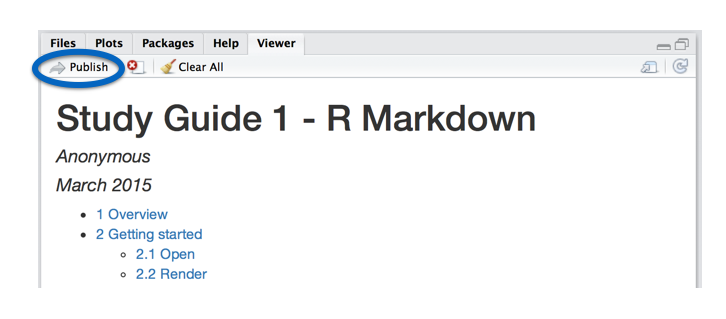

***

These notes explain how to write reports with R Markdown. The notes accompany RStudio's workshop, [Interactive Reporting with R Markdown and Shiny](http://shiny-dc.eventbrite.com). For more details on using R Markdown see <http://rmarkdown.rstudio.com>.


# Overview

This is an R Markdown document. It is written in markdown, a simple formatting syntax for authoring HTML, PDF, and MS Word documents, as well as slideshows. The document contains R code that has been embedded in lines of text like this:

This document was rendered on `r Sys.Date()` with R version `r getRversion()`.

It also contains code embedded in code chunks like the one below. 

```{r fig.height = 4, fig.width = 5}
plot(cars)
```

When you click the **Knit** button, R Markdown generates a document that includes both your content as well as the output of any R code chunks embedded in your document. You can use this system to document your work in R, or to generate reports built from R code.

R Markdown is heavily [integrated into the RStudio IDE](http://shiny.rstudio.com/articlesrmd-integration.html).

# Getting started

To begin using R Markdown, download

1. R at <http://cran.r-project.org>
2. RStudio IDE at <http://www.rstudio.com/download>
3. LaTex at <http://www.latex-project.org/ftp.html>

Beware that Tex is a large download. 

## Open

To open a new R Markdown report, 

1. click _File > New File > R Markdown..._ in the RStudio toolbar. 
2. Then select "Document" and "HTML" in the wizard that appears. 

RStudio will open a new _.Rmd_ file that contains a self-explanatory template.


## Render 

When you render a _.Rmd_ file, R Markdown

1. Runs each chunk of R code in the document and embeds the output into the report. 
2. Recreates the contents of the _.Rmd_ file in a new file format. R Markdown will save the new file on your computer alongside the original _.Rmd_ file. 

You can render an R Markdown file in two ways.

### With the RStudio IDE

To render an R Markdown file, click the knit button that appears above the file in the RStudio IDE. RStudio will render the file and open a preview of the output document.


If you wish to create a different format of output, select the triangle next to the knit button to open a drop down menu. Then select the desired format.

### At the command line

To render an R Markdown file at the command line, run 

```{r eval = FALSE}
rmarkdown::render("<filepath>")
```

Give `render()` the file path from your working directory to the _.Rmd_ file that you wish to render. 


## Publish

To publish an R Markdown file to the web, click the "Publish" icon in the RStudio IDE preview window. 



Your document will be published at its own URL hosted at [rPubs.com](http://rpubs.com/), a free web hosting service for R Markdown documents. You can share the URL with friends where they can comment on the document.

Your document will also appear on the front page of [rPubs.com](http://rpubs.com/) where it will gradually be displaced by more recent documents.

# Markdown

**Markdown** is a markup language the R Markdown uses to format text. To write in [markdown](http://daringfireball.net/projects/markdown/basics), you insert unobtrusive formatting signals into plain text. 

The RStudio IDE

## Markdown Style Guide

## Your Turn 1
***
**Your Turn 1** - _Format each line below with markdown to display what the line describes. Then re-render the study guide._  

***

You can use markdown to indicate

A first level header  
A second level header  
A third level header  
A fourth level header  
A fifth level header  
A sixth level header  

A block quote  
A code block  

bold text  
italic text  
Monospaced text (e.g., code)  
striked text  
superscripts2  

An inline equation, E = mc^{2}.  
An equation block (below)  
E = mc^{2}  

A hyperlink (to rmarkdown.rstudio.com)  
An image (like orb.png)  
A horizontal rule (below)  

An unordered list:  
Item 1  
Item 2  
sub-item 1  
sub-item 2  

An ordered list:  
Item 1  
Item 2  
sub-item 1  
sub-item 2  

A table:  
Header 1 Header 2  
Cell 1 Cell 2  
Cell 3 Cell 4  

***

You can learn about more of markdown's conventions in the _Markdown Quick Reference_ guide, which comes with the RStudio IDE.

To access the guide, open a _.md_ or _.Rmd_ file in RStudio. Then click the ? icon that appears above the document and select "Markdown Quick Reference". RStudio will open the _Markdown Quick Reference_ guide in the Help pane.


# knitr

`knitr` is an R package that embeds code and its results into text documents. It provides a way to weave code---and its results---into R Markdown documents.

## Inline code

To embed a piece of R code in a line of text, surround the code with a pair of backticks and the letter `r`, like this


When you render the document, `knitr` will replace the inline code with its result in your final document (inline code is _always_ replaced by its result). The result will appear as if it were part of the original text.

## Code chunks

To embed a chunk of R code into your report, surround the code with two lines that each contain three backticks. After the first set of backticks, include `{r}`, which alerts `knitr` that you have included a chunk of R code. 


When you render your document, `knitr` will run the code and append the results to the code chunk. 

## Chunk options

You can customize `knitr` output in several ways. Here are the most popular.

## Your Turn 2

***
**Your Turn 2** - Describe what each option does below, then add the options to the chunks they describe. Render the study guide before and after you make your changes and compare the results.

* `eval = FALSE` - DESCRIPTION  
   This is a very handy way to add example code to your report.

```{r}
colMeans(cars)
```

* `results = 'hide'` - DESCRIPTION  
   This is convenient if you wish to hide the results, but still use them in later code chunks.

```{r}
carmeans <- colMeans(cars)
```

```{r}
carmeans
```

* `echo = FALSE` - DESCRIPTION  
   This is a handy for adding plots to a report, since you usually do not want to see the code that generates the plot.

```{r}
plot(cars)
```

* `fig.width = 5, fig.height = 4` - DESCRIPTION   
   When adding multiple arguments to a code chunk, separate the arguments by a comma.

```{r}
plot(cars)
```

* `message = FALSE, warning = FALSE` - DESCRIPTION   

```{r}
message("This is a message.")
1 + 1
```

```{r}
warning("This is a warning!")
1 + 1
```

* `engine = 'python'` - To embed non-R code into a code chunk, add the option `engine = ` to the chunk. For example, this code chunk would evaluate python code (note that you will need to remove `eval=FALSE` and have a python compiler installed on your computer for this to work).

```{r engine='python', eval=FALSE}
x = 'hello, python world!'
print(x)
print(x.split(' '))
```

R Markdown recognizes the following languages, and you can write your own [language engine](http://yihui.name/knitr/demo/engines/) if you'd like to use a language not listed here.

```{r echo=FALSE}
names(knitr::knit_engines$get())
```

Learn more about formatting the output of code chunks at the [rmarkdown](http://rmarkdown.rstudio.com/authoring_rcodechunks.html) and [knitr](http://yihui.name/knitr/options) websites.

***

## Logistics

`knitr` will run the code in your document in a fresh R session. As a result, you will need to call `library()` within your document to load any packages that the code uses.

`knitr` runs each code chunk in the same R session. As a result each, chunk will have access to the objects created by previous chunks.


# YAML

Place a YAML header at the top of your _.Rmd_ file to customize the render process.

A YAML header is a section of `key: value` pairs surrounded by `---` marks, like below

```
---
title: "Untitled"
author: "Anonymous"
date: "July 10, 2014"
output: html_document
---
```

## output:

The `output:` key determines which type of file to build when you call `rmarkdown::render()`.

## Your Turn 3

***
**Your turn 3** - _Complete the list of output formats below. Then re-render this document as a pdf with a table of contents (toc) and numbered sections.  


R Markdown comes with seven basic output formats:

1. `html_document`, which will create HTML output (default)
2. `EXERCISE`, which will create EXERCISE  
3. `EXERCISE`, which will create EXERCISE  
4. `EXERCISE`, which will create EXERCISE  
5. `EXERCISE`, which will create EXERCISE  
6. `EXERCISE`, which will create EXERCISE  
7. `EXERCISE`, which will create EXERCISE  

***

You can override the YAML output value by manually selecting an output option from the knit button's drop down menu in the RStudio IDE. 

You can also override the YAML option by calling an `output_format` argument when rendering at the command line with `rmarkdown::render()`, like this

```{r eval = FALSE}
rmarkdown::render("my-doc.Rmd", output_format = "pdf_document")
```

You can render a _.Rmd_ file into multiple outputs simultaneaously by passing a vector of output names to `output_format`, like this

```{r eval = FALSE}
rmarkdown::render("my-doc.Rmd", output_format = c("html_document", "pdf_document"))
```

### output: options

To set an output option, use the following format in your YAML header

```
---
title: "Untitled"
author: "Anonymous"
date: "July 10, 2014"
output: 
  html_document:
    toc: true
    theme: flatly
---
```

Use `args` to see which output options a format recognizes:

```{r}
args(rmarkdown::html_document)
```

Change the style of an HTML output with the `css` and `theme` arguments. 

* `css` takes the filepath to a css style sheet
* `theme` takes the name of one of R Markdown's pre-packaged Bootstrap CSS themes:
    + `default`
    + `cerulean`
    + `journal`
    + `flatly`
    + `readable`
    + `spacelab`
    + `united`
    + `cosmo`

# Recap

R Markdown files are useful because

* They are quick and easy to write.
* You can embed executable R code into your file, which saves manual labor and creates a reproducible report.
* You can convert R Markdown files into HTML, PDF, and Word documents with the click of a button.
* You can convert R Markdown files into ioslides and beamer slideshows with the click of a button.