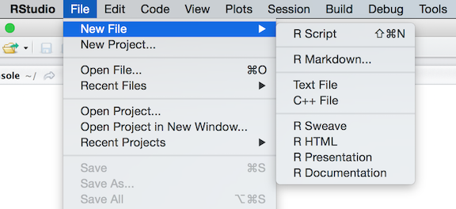
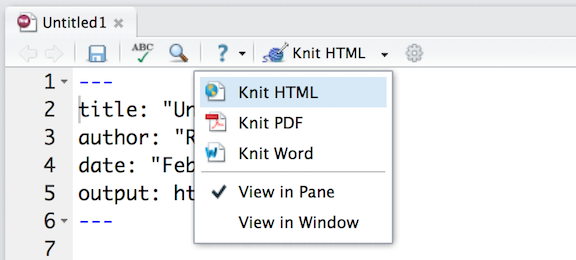

These notes explain how to write reports with R Markdown. The notes accompany RStudio's workshop, [Interactive Reporting with R Markdown and Shiny](http://shiny-dc.eventbrite.com). 

The companion study guide, _Interactive Documents Study Guide_, will show you how to turn an R Markdown report into an interactive document with Shiny components. For more details on using R Markdown see <http://rmarkdown.rstudio.com>.


# Background

This is an R Markdown document. It is written in markdown, a simple formatting syntax for authoring HTML, PDF, and MS Word documents. The document contains R code that has been embedded in lines of text like this:

This document was rendered on `r Sys.Date()` with R version `r getRversion()`.

...as well as R code that has been embedded in code chunks like the one below. 

```{r}
plot(cars)
```

When you click the **Knit** button, R Markdown generates a document that includes both your content as well as the output of any R code chunks that you've embedded in your document. You can use this system to document your work in R, or to generate dynamic reports built with R code. 

# Getting started

R Markdown files are designed to be used with the `rmarkdown` package. `rmarkdown` comes installed with the RStudio IDE, but you can acquire your own copy of `rmarkdown` from [github](www.github.com) with the command

```{r eval=FALSE}
devtools:install_github("rmarkdown", "rstudio")
```

These notes will assume that you are using the RStudio IDE.

To create an R Markdown report, open a new _.Rmd_ file by clicking _File > New File > R Markdown..._ in the RStudio toolbar. Then select "Document" and "HTML" in the wizard that appears. RStudio will open a new _.Rmd_ file that contains a self-explanatory template.



_Note: you can also create an R Markdown document by opening a plain text file and saving it with the extension .Rmd. The RStudio IDE enables several helpful buttons when you save the file with the_.Rmd_extension._

To render an R Markdown file, click the knit button that appears above the file in the RStudio IDE. 



R Markdown will knit the R code in the document and save a version of the finished file in the desired output format alongside the original _.Rmd_ file on your computer. RStudio will open a preview of the output document.

If you wish to create a different format of output, select the triangle next to the knit button to open a dropdown menu. Then select the desired format.

When you render a _.Rmd_ file, R Markdown transforms it in two ways.

1. **knit** - The `rmarkdown` package calls the `knitr` package, which runs each chunk of R code in your document and appends the results of the code to the document. This workflow saves time and facilitates reproducible reports. 

    Consider how authors typically include graphs (or tables, or numbers) in a report. The author makes the graph, saves it as a file, and then copy and pastes it into the final report. This process relies on manual labor. If the data changes, the author must repeat the entire process to update the graph.

    In the R Markdown paradigm, each report contains the code it needs to make its own graphs, tables, numbers, etc. You can automatically update the report by re-knitting it.

2. **convert** - The `rmarkdown` package uses the [pandoc](http://johnmacfarlane.net/pandoc/) program to build a new file format from the _.Rmd_ file. R Markdown can build markdown, HTML, PDF, or Microsoft Word files from a _.Rmd_ file. It can also build HTML5 or PDF slideshows. Each of these outputs will contain the text, code results, and formatting contained in your original _.Rmd_ file.

    Conversion lets you do your original work in markdown, which is very easy to use. You can include R code to knit, and you can share your document in a variety of formats.
    
    _Note: RStudio does not build PDF documents from scratch. You will need to have a distribution of Latex installed on your computer to make PDFs. R Markdown can build Microsoft Word documents from scratch, but you will want Microsoft Word (or a similar program) installed to open these files._

In these notes, I will use the term _render_ to refer to the two step process of knitting and converting an R Markdown file.

You can manually render an R Markdown file with `rmarkdown::render()`. In practice, you do not need to call `rmarkdown::render()`. You can use the knit button in the RStudio IDE to render your report. R Markdown is heavily [integrated into the RStudio IDE](http://shiny.rstudio.com/articlesrmd-integration.html).

# Details

R Markdown reports rely on three frameworks

1. markdown for formatted text
2. `knitr` for embedded R code
3. YAML for conversion parameters

The sections below describe each framework.

## Markdown for formatted text

.Rmd files are meant to contain text written in [markdown](http://daringfireball.net/projects/markdown/basics). Markdown is a set of conventions for formatting plain text. The conventions of markdown are very unobtrusive, which make Markdown files easy to read. 

### Markdown Style Guide
***
**Exercise 1** - _Format each line below to display what the line describes._  

***

You can use markdown to indicate

A first level header  
A second level header  
A third level header  
A fourth level header  
A fifth level header  
A sixth level header  

A block quote  
A code block  

bold text  
italic text  
Monospaced text (e.g., code)  
striked text  
superscripts2  

An inline equation, E = mc^{2}.  
An equation block (below)  
E = mc^{2}  

A hyperlink (to rmarkdown.rstudio.com)  
An image (like orb.png)  
A horizontal rule (below)  

An unordered list:  
Item 1  
Item 2  
sub-item 1  
sub-item 2  

An ordered list:  
Item 1  
Item 2  
sub-item 1  
sub-item 2  

A table:  
Header 1 Header 2  
Cell 1 Cell 2  
Cell 3 Cell 4  

***

You can learn about more of markdown's conventions in the _Markdown Quick Reference_ guide, which comes with the RStudio IDE.

To access the guide, open a _.md_ or _.Rmd_ file in RStudio. Then click the question mark icon that appears above the document and select "Markdown Quick Reference". RStudio will open the _Markdown Quick Reference_ guide in the Help pane.


## knitr for embedded R code

The `knitr` package extends the basic markdown syntax to include chunks of executable R code. When you render the report, `knitr` will run the code and add the results to the output file. You can have the output display just the code, just the results, or both.

To embed a piece of R code in a line of text, surround the code with a pair of backticks and the letter `r`, like this


`knitr` will replace the inline code with its result in your final document (inline code is _always_ replaced by its result). The result will appear as if it were part of the original text.

To embed a chunk of R code into your report, surround the code with two lines that each contain three backticks. After the first set of backticks, include `{r}`, which alerts `knitr` that you have included a chunk of R code. 

When you render your document, `knitr` will run the code and append the results to the code chunk. `knitr` will provide formatting and syntax highlighting to both the code and its results (where appropriate).

As a result, the markdown snippet to the left will look like this when rendered (to HTML).


### knitr chunk options

***
**Exercise 2** - Describe what each option does below, then add the options to the chunks they describe.  

***

You can customize knitr output in several ways. Here are the most popular.

* `eval = FALSE` -  
   This is a very handy way to add example code to your report.

```{r}
colMeans(cars)
```

* `results = 'hide'` -  
   This is convenient if you wish to hide the results, but still use them in later code chunks.

```{r}
carmeans <- colMeans(cars)
```

```{r}
carmeans
```

* `echo = FALSE` -  
   This is a handy for adding plots to a report, since you usually do not want to see the code that generates the plot.

```{r}
plot(cars)
```

* `fig.width = 5, fig.height = 4` -  
   When adding multiple arguments to a code chunk, separate the arguments by a comma.

```{r}
plot(cars)
```

* `message = FALSE, warning = FALSE` -  

```{r}
message("This is a message.")
warning("This is a warning!")
```

* `engine = 'python'` - To embed non-R code into a code chunk, add the option `engine = ` to the chunk. For example, this code chunk would evaluate python code (note that you will need to remove `eval=FALSE` and have a python compiler installed on your computer for this to work).

```{r engine='python', eval=FALSE}
x = 'hello, python world!'
print(x)
print(x.split(' '))
```

R Markdown recognizes the following languages, and you can create your own [language engine](http://yihui.name/knitr/demo/engines/) if you'd like to use a language not listed here.

```{r echo=FALSE}
names(knitr::knit_engines$get())
```

You can learn more about formatting the output of code chunks at the [rmarkdown](http://rmarkdown.rstudio.com/authoring_rcodechunks.html) and [knitr](http://yihui.name/knitr/options) websites.

## YAML for render parameters

You can use a YAML header to control how `rmarkdown` renders your _.Rmd_ file. A YAML header is a section of `key: value` pairs surrounded by `---` marks, like below

```
---
title: "Untitled"
author: "Anonymous"
date: "July 10, 2014"
output: html_document
---
```

The `output:` key determines which type of file to build when you call `rmarkdown::render()`. _Note: you do not need to specify `output:` if you render your file with the RStudio IDE knit button._

***
**Exercise 3** - _Complete the list of output formats below. Then re-render this document as a pdf with a table of contents (toc) and numbered sections.  

***

R Markdown comes with seven basic output formats:

1. `html_document`, which will create HTML output (default)
2. `EXERCISE`, which will create EXERCISE  
3. `EXERCISE`, which will create EXERCISE  
4. `EXERCISE`, which will create EXERCISE  
5. `EXERCISE`, which will create EXERCISE  
6. `EXERCISE`, which will create EXERCISE  
7. `EXERCISE`, which will create EXERCISE  

You can override the YAML output value by manually selecting an output option from the knit button's drop down menu in the RStudio IDE. You can also override the YAML option by calling an `output_format` argument when rendering at the command line with `rmarkdown::render()`, like this

```{r eval = FALSE}
rmarkdown::render("my-doc.Rmd", output_format = "pdf_document")
```

You can render a _.Rmd_ file into multiple outputs simultaneaously by passing a vector of output names to `output_format`, e.g.

```{r eval = FALSE}
rmarkdown::render("my-doc.Rmd", output_format = c("html_document", "pdf_document"))
```

You can further customize each output format with options specific to that format. To see the list of options that a format recognizes (along with the default options of the format) refer to the format as a function with `args`, i.e.

```{r}
args(rmarkdown::html_document)
```

To set an output option, use the following format in your YAML header

```
---
title: "Untitled"
author: "Anonymous"
date: "July 10, 2014"
output: 
  html_document:
    toc: true
    theme: flatly
---
```

Visit [rmarkdown.rstudio.com](http://rmarkdown.rstudio.com/html_document_format.html) to learn about more YAML options that control the render process.

# Publishing

You can immediately publish any HTML based R Markdown document to the internet by clicking the "Publish" icon in the RStudio IDE preview window. 

Your document will be published at its own URL hosted at [rPubs.com](http://rpubs.com/), a free web hosting service for R Markdown documents. You can share the URL with friends where they can comment on the document.

Notice that [rPubs.com](http://rpubs.com/) is not intended for private or secure communication. Your document will also appear on the front page of [rPubs.com](http://rpubs.com/) where it will gradually be displaced by more recent documents.
