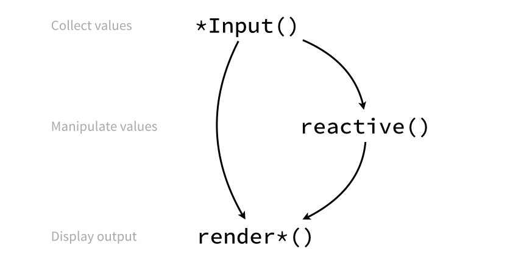
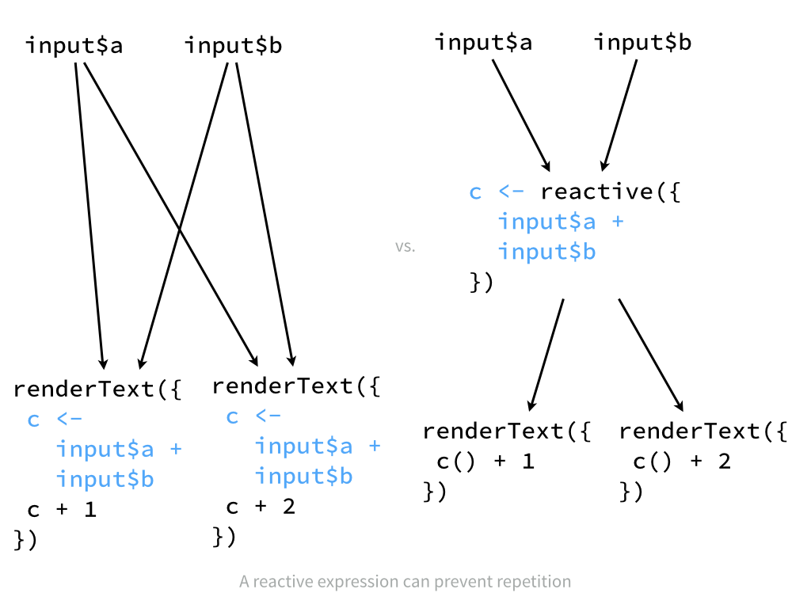
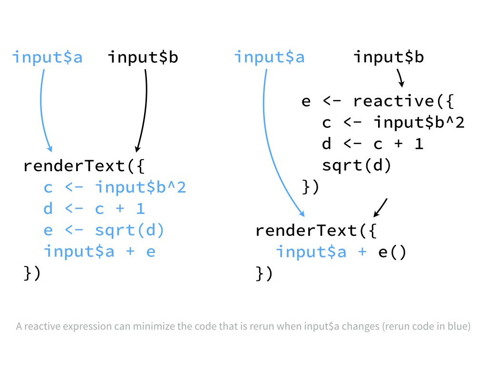

***

These notes explain how to create interactive documents with R Markdown and Shiny. The notes accompany RStudio's workshop, [Interactive Reporting with R Markdown and Shiny](http://shiny-dc.eventbrite.com). For more details on using R Markdown see <http://rmarkdown.rstudio.com>.

The companion study guide, _Study Guide 3 - Shiny Web Apps_, will show you how to build stand alone Shiny apps with a customized layout. For more details on using Shiny see <http://shiny.rstudio.com>.

# Interactive Documents

You can embed two types of interactive components in an R Markdown report

1. **HTML widgets** - prepackaged interactive visualizations built with JavaScript.
2. **Shiny functions** - Functions from the Shiny package, which provides an interactive framework for running R code.

# HTML widgets

`htmlwidgets` is an R package that provides a framework for creating R bindings to JavaScript visualization libraries. To learn more about `htmlwidgets`, or to write your own R bindings for JavaScript libraries visit <http://www.htmlwidgets.org>.

## Package list

These packages use `htmlwidgets` to create interactive JavaScript-based visualizations in R. You do **not** need to know JavaScript to use these packages:

* [Leaflet](http://rstudio.github.io/leaflet/) - Interactive maps
* [dygraphs](http://rstudio.github.io/dygraphs/) - Time series charting
* [MetricsGraphics](http://hrbrmstr.github.io/metricsgraphics/) - Scatterplots and line charts with D3
* [networkD3](http://christophergandrud.github.io/networkD3/) - Network visualizations with D3
* [DataTables](http://rstudio.github.io/DT/) - Interactive tables of data
* [threejs](https://github.com/bwlewis/rthreejs) - 3D scatterplots and globes
* [DiagrammeR](http://rich-iannone.github.io/DiagrammeR/) - Diagrams and flowcharts
* [rCharts](http://rcharts.io/) - Multiple JavaScript charting libraries

See <http://www.htmlwidgets.org> for a complete list.

## dygraphs example

The code chunk below embeds an interactive time series chart created with the `dygraphs` package.

```{r fig.width = 6}
library(dygraphs)

hw <- HoltWinters(ldeaths)
p <- predict(hw, n.ahead = 36, prediction.interval = TRUE)
all <- cbind(ldeaths, p)

dygraph(all, "Deaths from Lung Disease (UK)") %>%
  dySeries("ldeaths", label = "Actual") %>%
  dySeries(c("p.lwr", "p.fit", "p.upr"), label = "Predicted") %>%
  dyRangeSelector()
```

# Shiny

`Shiny` is an R package that provides a framework for creating reactive web apps with R. The Shiny framework creates a "chain" of reactivity with three families of functions:

* `*Input` functions create a widget to collect values from your user
* `reactive()`, `observe()`, and `isolate()` functions manipulate user values after they have been collected
* `render*` functions render finished values into reactive output for display.



## Setup

To use Shiny components in an R Markdown document

1. Change the document's output format to an HTML format, which is one of
    + `html_document`
    + `ioslides_presentation`, or 
    + `slidy_presentation`
2. Notify R Markdown that your file contains Shiny components by adding `runtime: shiny` to the file's YAML header. 
    + RStudio will change its "Knit" icon to a "Run Document" icon when you save this change.
3. Include `library(shiny)` near the beginning of the document
    + i.e., before you call your first Shiny function.

### What does it mean to "run" a Shiny app? 

Shiny creates reactivity by monitoring each Shiny app with an R process. Shiny uses the R process to immediately rebuild components of the app when as they become out of date due to user interactions. `runtime: shiny` tells R Markdown to run an R process to monitor the document (app) while it is open. 

When you create Shiny apps on your computer, your local R session will monitor the app. When you host Shiny apps online, your web server will run an R process to monitor the app. `runtime: shiny` tells R Markdown that it will need to monitor the output document while it is open.

## *Input() functions

`*Input` functions create a widget that your user can manipulate, like a slider or a text field. To add an input widget to your document, call an `*input` function in an R code chunk. R Markdown will add the widget to the code chunk's output. 

### Syntax

With one or two exceptions, each function name has the form `*Input`, and each function takes the same first two arguments:

1. `inputId` - a character string. This will be the name you use to refer to the widget's value in your code
2. `label` - a character string. R will display this text to your users alongside the widget.

Each `*Input` function also takes additional arguments that are related to the type of widget the function creates. 

### Your Turn 1

***
**Your Turn** 

1. Set up this study guide to use Shiny components. 
2. Then modify the code chunks below to return an example of each of Shiny's `*Input` widgets. You will need to add the appropriate arguments to each function. 
3. After you finish each function, remove `eval = FALSE` and render the document to see the function's output.

***

```{r eval = FALSE}
actionButton()
```

```{r eval = FALSE}
actionLink()
```

```{r eval = FALSE}
checkboxInput()
# value - TRUE or FALSE. Should the checkbox begin checked?
```

```{r eval = FALSE}
checkboxGroupInput()
# choices - Character vector. List of values to show checkboxes for.
# selected - Character vector. List of checkboxes to begin checked.
# inline - TRUE or FALSE. Should the boxes be shown inline (vs. above one another)?
```

```{r eval = FALSE}
dateInput()
# value - NULL, a Date object, or a string in yyy-mm-dd format. The starting date.
```

```{r eval = FALSE}
dateRangeInput()
# start - NULL, a Date object, or a string in yyy-mm-dd format. The initial start date.
# end - NULL, a Date object, or a string in yyy-mm-dd format. The initial end date.
```

```{r eval = FALSE}
fileInput()
```

```{r eval = FALSE}
numericInput()
# value - Numeric. Initial value
# min - Numeric. Minimum value allowed.
# max - Numeric. Maximum value allowed.
# step - Numeric. Interval to use when stepping between min and max.
```

```{r eval = FALSE}
passwordInput()
# value - Character string. Initial value
```

```{r eval = FALSE}
radioButtons()
# choices - Character vector. List of values to select from.
# selected - Character string. The initial selected value.
# inline - TRUE or FALSE. Should the buttons be shown inline (vs. above one another)?
```

```{r eval = FALSE}
selectInput()
# choices - Character vector. List of values to select from.
# selected - Character string. The initial selected value.
# multiple - TRUE or FALSE. Can user select multiple items?
```

```{r eval = FALSE}
selectizeInput()
# choices - Character vector. List of values to select from.
# selected - Character string. The initial selected value.
# multiple - TRUE or FALSE. Can user select multiple items?
```

```{r eval = FALSE}
sliderInput()
# value - Numeric. Initial value
# min - Numeric. Minimum value allowed.
# max - Numeric. Maximum value allowed.
# step - Numeric. Interval to use when stepping between min and max.
# animate - TRUE or FALSE. Show simple animation controls with slider?
```

```{r eval = FALSE}
textInput()
# value - Character string. Initial value
```

## Reactive Values

A **reactive value** is a value that can change whenever a user interacts with your app. 

Each input widget collects a reactive value from your user. The value always matches the current value of the widget. When a user changes the widget, it triggers a process that updates the reactive value. 

Access the value of a widget with 

```{r eval = FALSE}
input$<inputId>
```

where `<inputId>` corresponds to the `inputId` argument of the `*Input` function that created the widget.

### Handling reactive values

R will return an error if you try to use a reactive value in standard R code.

To use a reactive value wrap it in one of 

1. `reactive()`
2. `render*()` functions
3. `observe()`
4. `isolate()`

Each of these functions takes a chunk of code and screens it for reactive values before executing the code. Each function returns a different type of output.

## reactive()

Use `reactive()` to wrap code that returns a _new reactive value_.

`reactive()` turns a chunk of code into a **reactive expression**, a type of function that takes no arguments. When you call a reactive expression, R 

* looks up the current value of each reactive value in the expression 
* runs the expression with the current values
* returns the result as a reactive value
* caches the result, R will return this cached result (without doing computation) each time the reactive expression is called until one of the reactive values in the expression changes.

The output of a reactive expression is reactive. It will become out of date whenever one of the reactive values in the expression becomes out of date. This will trigger a process that will ultimately update the output. 

Since reactive expressions return a reactive value, you must call their output with one of 

1. `reactive()`
2. `render*()`
3. `observe()`
4. `isolate()`

***

**TIP** - remember to call a reactive expression like a function, with parentheses behind the name
***

## render*()

Use a `render*()`function to wrap code that builds _something to be displayed_, like a plot, table, or piece of text. The last line of the code chunk should return the object to be displayed.

Shiny provides six `render*()` functions that each build a different type of reactive output. 

render function  | creates
------------- | -------------
`renderDataTable` | data frame, matrix, other table like structures
`renderImage`  | images (saved as a link to a source file)
`renderPlot`  | plots
`renderPrint` | any printed output
`renderTable` | data frame, matrix, other table like structures
`renderText` | character strings
`renderUI` | a Shiny tag object or HTML

R Markdown will display the output alongside the `render*` function in the rendered document. The displayed output will update whenever one of the reactive values in the `render*` code changes.

### Your Turn 2

***
**Your Turn** - Complete the code blocks below to make two sliders and two interactive pieces of text. Be sure to assign each slider to a unique inputId. 

Render the document when you are finished and check that the text updates as you would expect.

***

```{r}
# create a slider input that selects a number
# create a reactive expression that computes the factorial of the slider number
# render a piece of text that displays the result of the factorial
```

```{r}
# create a slider input that selects a number
# do not use a reactive expression here
# render a piece of text that displays the factorial of the number above
```

_Note: you can put Shny inputs and outputs in separate code blocks. With R Markdown, the objects that you create in one code block are available in later code blocks._

#### When should you use a reactive expression?

Use a reactive expression when:

1. More than one `render*()` statement depends on the result of the reactive expression.  
   This will modularize your code. You can run an expression once in a reactive expression instead of multiple times in each `render*` statement that the expression appears in.
    


2. The code in `render*()` depends on more than one reactive value.  
   Then R can rely on the caching behaviour of up-to-date reactive expressions to avoid re-running unnecessary code when a different reactive value in the `render*()` call becomes out of date. 
    

## observe()

Use `observe()` to wrap code that generates a _side effect_ (does not return a value).

`observe()` executes a block of code whenever a reactive value in the code block changes. `observe()` does not return a value and should be reserved for code that returns side effects, e.g.

```{r eval = FALSE}
actionButton(inputId = "stop", "Click to stop app!")

observe({
  if (input$stop != 0) stopApp()
})
```

Note that Shiny will run the code wrapped by `observe()` once when the app first launches.

## isolate()

Use `isolate()` to wrap code that should return a _non-reactive value_.

`isolate()` evaluates a block of code that contains reactive values and returns the result as a non-reactive value, e.g.

```{r eval=FALSE}

actionButton(inputId = "count", "+ 1")

# reactive value
renderText(input$count)

# non-reactive value
renderText(isolate(input$count))

# safe to do
sqrt(isolate(input$count))
```

The result will not update when the reactive value changes. The output of `isolate()` can be used in standard R code.


### Your Turn 3

***
**Your Turn** - `isolate()` provides a useful way to delay reactions when combined with an `actionButton()`. To see this:

1. Remove `eval = FALSE` from the code chunk below.

2. Use `isolate()` to prevent the histogram from updating when the slider changes. Wrap as little code in `isolate()` as possible. Check that your method worked.

3. Add an `actionButton()` to the code chunk, and have the `renderPlot()` code call the action button. The code does not need to do anything particular with the button's value, it can just look it up and then move on to the histogram.

4. Re-render the document. Change the slider. What happens to the plot? Click the action button. What happens to the plot?

***

```{r eval = FALSE}
sliderInput("n_breaks", label = "Number of bins:", min = 10, max = 50, value = 25)

renderPlot({
  
  hist(faithful$eruptions, breaks = input$n_breaks,
       probability = TRUE, xlab = "Duration (minutes)", 
       main = "Geyser eruption duration")
})
```

# Tips

## Converting static code to reactive code

To convert standard R code to Shiny code, add some input widgets. Then examine each object in the code and determine:

1. Is the object reactive or non-reactive?
2. Is the object referred to correctly (`name` vs. `input$name` vs. `names()`)?
3. If the object is reactive, does it appear in code wrapped by
   + `reactive()`
   + a `render*()` function
   + `isolate()` 
   + or `observe()`?

## Common error messages

You will get an error message each time you run the document until the process above is complete.

Error message  | Suggests (example var names)
------------- | -------------
`object 'name' not found`  | change `name` to `input$name`
`object is not a ...`  | change `nbirths` to `nbirths()`
`no applicable method applied to class 'reactive'`  | change `nbirths` to `nbirths()`
`object of type closure is not subsettable` | change `pred$mean` to `pred()$mean`