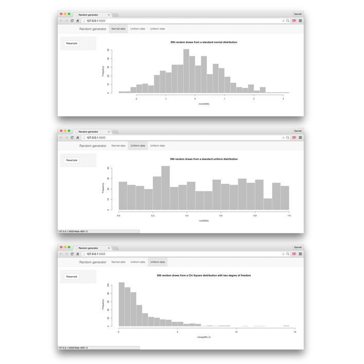

```{r echo = FALSE}
library(shiny)
```

***

These notes explain how to create Shiny Web Apps. The notes accompany RStudio's workshop, [Interactive Reporting with R Markdown and Shiny](http://shiny-dc.eventbrite.com). For more details on using Shiny see <http://shiny.rstudio.com>.

The notes build upon a companion study guide, _Study Guide 2 - Interactive Docs_, which explains how to control reactivity in a Shiny app.

# Apps

A Shiny app is a web document built by Shiny to display interactive R output. You can build a Shiny app in two ways

1. Embed Shiny components in an R Markdown document
2. Call `shinyApp()`, which provides more control over the appearance and layout of your app than R Markdown does

## shinyApp()

`shinyApp()` takes two arguments

1. `server` - the server function for the app. This function explains to the server how to build and rebuild each reactive component of the app.
2. `ui` - the user interface for the app. The ui is an HTML document. You can write this document in HTML, but it is more common to assemble the ui from R code with Shiny's layout functions. 

### server

`server` takes an unnamed function with three characteristics:

1. The function takes an `input` argument and an `output` argument, like this.
2. The body of the function contains the code that builds the rendered outputs. 
3. The code in the body saves each rendered output as an element of the `output` argument. Shiny will use reference class semantics to look up these elements when it assembles the app.

The function below demonstrates each of these features

```{r}

# saving the function as serv to pass to shinyApp() later
serv <- function(input, output) {

  # creates one rendered output, a histogram
  # assigns the histogram to output$hist
  output$hist <- renderPlot({
  
    # refers to input values with input$ syntax
    hist(faithful$eruptions, breaks = input$n_breaks,
       probability = TRUE, xlab = "Duration (minutes)", 
       main = "Geyser eruption duration")
  })
}
```

Early versions of Shiny required the server function to be wrapped with `shinyServer()`. This is no longer necessary.

### ui

`ui` takes a user interface built from Shiny functions that return HTML (or, alternatively, raw HTML). The simplest Shiny UI looks like this

```{r eval = FALSE}

# fluidPage() creates an HTML div
fluidPage(
  # sidebarLayout() divides the div into a layout with two panels
  sidebarLayout(
    sidebarPanel(),
    mainPanel()
  )
)
```

The ui should contain

* Shiny functions that layout the ui
* the input widgets used by the app
* the output objects displayed by the app
* other text and layout elements

To place elements in the ui, pass them as arguments to a layout function. 

```{r}

# saving the ui as ui to pass to shinyApp() later
ui <- fluidPage(
  sidebarLayout(
    
    # Placing a slider widget in the sidebar panel
    sidebarPanel(
      sliderInput("n_breaks", label = "Number of bins:", 
                  min = 10, max = 50, value = 25)
    ),
    
    # Placing a rendered plot into the main panel
    mainPanel(plotOutput("hist"))
  )
)
```

#### Reactive output

Use an `*Output` function to insert reactive output into the ui. Each function takes a character string: the name of a rendered output that has been saved to `output` in the app's server function.

`*Output` function  | inserts
------------- | -------------
`dataTableOutput` | an interactive table
`htmlOutput`  | raw HTML
`imageOutput`  | an image
`plotOutput` | a plot
`tableOutput` | a table
`textOutput` | text
`uiOutput` | a Shiny UI element
`verbatimText` | text

Early versions of Shiny required the ui to be wrapped with `shinyUI()`. This is no longer necessary.

### A complete app

Assemble your app by calling `shinyApp()` with your complete server and ui objects:

```{r}
shinyApp(server = serv, ui = ui)
```

## Your Turn 1

***
**Your Turn** - The code below generates a histogram of 500 random standard normal values. Use the code to build a shiny app in the R code chunk below.

1. Define a ui that splits the app into a sidebar and a main panel
2. Add an action button to the sidebar
3. Insert a rendered plot into the main panel
4. Write a server function that re-renders a histogram each time the action button is pressed
    + Note: the value of an action button increases by one each time it is pressed.
5. Assemble the components togther with `shinyApp()`

```{r}
    hist(rnorm(500), breaks = 30, col = "grey", border = "white",
       main = "500 random draws from a standard normal distribution")
```

***

## App directories

Package your app into a single directory to 

* host the app online
* organize supporting files into a single directory

### app.R

To save an app as a directory, create a new directory (for example, `newdir/`) and place a file called `app.R` in the directory. `app.R` should end with a call to `shinyApp()`.


### runApp()

To run an app saved as a directory, call `runApp()` and give it the path to the directory, e.g.

```{r eval = FALSE}
runApp("newdir")
```

### Two file apps

Make long apps more manageable by separating the app into two files:

1. `server.R` - a file that contains the server function (everything you would pass to `server` of `shinyApp()` plus any preamble to calling `shinyApp()`, such as  
    + calls to `library()`
    + calls to `source()`
    + function definitions for the app to use
2. `ui.R` - a file that contains the ui object.

Save the two files in the same directory (for example, `appdir/`). Run the app by calling 

```{r eval = FALSE}
runApp("appdir")
```

You do not need to call `shinyApp()` within `server.R` or `ui.R`.

# Layout

Customize the layout of your app in two ways:

1. **Grids** - arrange elements within the app on a grid of rows and columns
2. **Panels** - sub-divide your app into multiple panels that the user can navigate between

## Grid System

To build a grid within `fluidPage()` or any of the panel functions listed below:

1. Add one or more rows to the grid by calling `fluidRow()`
2. Add one or more columns to a row with `column()`
3. Place elements into `fluidRow()` or `column()` just as we placed elements into `sidebarPanel()` and `mainPanel()` above.

### fluidRow()

`fluidRow()` creates a horizontal row that spans whichever panel it is inserted in. Elements placed into `fluidRow()` will appear at the lefthand side of the row.

Additional calls to `fluidRow()` insert additional rows beneath the first row.

```{r}
serv <- function(input, output) {}
ui <- fluidPage(
  # wellPanel() adds a grey background to place elements on top of
  fluidRow(wellPanel("First Row")),
  fluidRow(wellPanel("Second Row"))
)
shinyApp(server = serv, ui = ui)
```

### column()

`column()` adds a column to a `fluidRow()`. Columns do not extend beyond the row, so each row contains its own columns. Additional calls to `column()` will add additional columns to the right of the first.

Tweak the width and placement of columns with
* `width` - the width of the column measured in bootstrap units
* `offset` - the distance between this column and the previous column measured in bootstrap units.

A bootstrap unit is 1/12 of the width of the row that the column is inserted in.

_Note: you will need to view the example below in an external window to see the columns arranged beside each other_

```{r}
serv <- function(input, output) {}
ui <- fluidPage(
  fluidRow(
    column(width = 3, wellPanel("Row: 1, Col: 1")),
    column(width = 4, wellPanel("Row: 1, Col: 2"))
  ),
  fluidRow(
    column(width = 3, wellPanel("Row: 2, Col: 1")),
    column(width = 4, offset = 2, wellPanel("Row: 2, Col: 2"))
  )
)
shinyApp(server = serv, ui = ui)
```

## Panel System

`tabPanel()` creates a discrete panel that hides elements until the user navigates to the panel. `tabPanel()`s are meant to be used with one of the functions below.

You can subdivide a portion of your app into `tabPanel()`s with 

* `tabsetPanel()`
* `navlistPanel()`

You can subdivide your entire app into separate `tabPanel()`'s (e.g., pages) with 

* `navbarLayout()`

### tabsetPanel()

`tabsetPanel()` organizes multiple `tabPanel()`s into a set of tabs. Each `tabPanel()` should have a title, which will appear in its tab.

_Note: view the example below in an external window to see the side by side layout_

```{r}
serv <- function(input, output) {}
ui <- fluidPage(
  fluidRow(
    sidebarPanel("This is not a tabPanel. It will always be visible"),
    tabsetPanel(
      tabPanel(title = "Tab 1", "The first tabPanel"),
      tabPanel(title = "Tab 2", "The second tabPanel"),
      tabPanel(title = "Tab 3", "The third tabPanel")
    )
  )
)
shinyApp(server = serv, ui = ui)
```

### navlistPanel()

`navlistPanel()` organizes multiple `tabPanel()`s into a navigation list (sidebar). Each `tabPanel()` should have a title, which will appear as a link in the list.

_Note: view the example below in an external window to see the side by side layout_

```{r}
serv <- function(input, output) {}
ui <- fluidPage(
  fluidRow(
    wellPanel("This is not a tabPanel. It will always be visible")
  ),
  fluidRow(
    navlistPanel(
      tabPanel(title = "Tab 1", "The first tabPanel"),
      tabPanel(title = "Tab 2", "The second tabPanel"),
      tabPanel(title = "Tab 3", "The third tabPanel")
    )
  )
)
shinyApp(server = serv, ui = ui)
```

### navbarPage()

`navbarPage()` organizes multiple `tabPanel()`s into "pages" linked by a navbar at the top of each page. Each `tabPanel()` should have a title, which will appear as a link in the navbar.

`navbarPage()` replaces `fluidPage()`. 

_Note: view the example below in an external window to see the side by side layout_

```{r}
serv <- function(input, output) {}

# navbarPage() expects a title argument
ui <- navbarPage(title = "My page",
      tabPanel(title = "Tab 1", "The first tabPanel"),
      tabPanel(title = "Tab 2", "The second tabPanel"),
      tabPanel(title = "Tab 3", "The third tabPanel")
)
shinyApp(server = serv, ui = ui)
```

## Your Turn 2



***
**Your Turn 2** - Modify the ui of the app below so it resembles the app pictured above. Then remove `eval = FALSE` and rerender the Study Guide.

```{r eval = FALSE}
serv <- function(input, output) {
  output$norm <- renderPlot({
    input$renorm
    hist(rnorm(500), breaks = 30, col = "grey", border = "white",
      main = "500 random draws from a standard normal distribution")
  })
  output$unif <- renderPlot({
    input$reunif
    hist(runif(500), breaks = 30, col = "grey", border = "white",
      main = "500 random draws from a standard uniform distribution")
  })
  output$chisq <- renderPlot({
    input$rechisq
    hist(rchisq(500, 2), breaks = 30, col = "grey", border = "white",
       main = "500 random draws from a Chi Square distribution with two degree of freedom")
  })
}

ui <- fluidPage(
  fluidRow(
    column(width = 2,
      wellPanel(actionButton("renorm", "Resample"))
    ),
    column(width = 10,
      plotOutput("norm")
    )
  ),
  fluidRow(
    column(width = 2,
      wellPanel(actionButton("reunif", "Resample"))
    ),
    column(width = 10,
      plotOutput("unif")
    )
  ),
  fluidRow(
    column(width = 2,
      wellPanel(actionButton("rechisq", "Resample"))
    ),
    column(width = 10,
      plotOutput("chisq")
    )
  )
)

shinyApp(server = serv, ui = ui, options = list(height = 1000))
```

***

## Learn More

Learn more about specific layout topics at <http://shiny.rstudio.com/articles>. Articles include:

* **[Application Layout Guide](http://shiny.rstudio.com/articles/layout-guide.html)** - In depth guide to Shiny layouts
* **[Build your entire UI with HTML](http://shiny.rstudio.com/articles/html-ui.html)** - Embed Shiny into HTML documents
* **[Build a dynamic UI that reacts to user input](http://shiny.rstudio.com/articles/dynamic-ui.html)** - Let the ui respond to user selections
* **[Shiny Dashboards](http://rstudio.github.io/shinydashboard/)** - Quickly lay out Shiny powered dashboards with `shinydashboard`

# Formatting

You can format a Shiny app as if it were a web page.

## HTML

`shiny::tags` is a list of functions that recreate HTML tags. Use these to format elements in your ui.

Each tag function returns its arguments as a piece of HTML wrapped in the corresponding HTML tag:

```{r eval = FALSE}
tags$img(src = "www.rstudio.com", width = "100px", height = "100px")
## 
```

The most common tags have a helper function, which you can use to avoid typing `tags$`.

function  | creates
------------- | -------------
`a()` | a web link
`br()`  | a line break
`code()`  | Monospaced text
`div()` | an HTML division
`em()` | emphasized (italicized) text
`h1(), h2(), h3(), h4(), h5(), h6()` | hierarchical headings
`hr()` | a horizontal line
`p()` | a new paragraph
`pre()` | Monospaced text
`span()` | a group of inline elements
`strong()` | bold text
`tags$img` | An image
`tags$ol()`, `tags$ul()`, `tags$li()` | orderd list, unordered list, list item

A complete list of tags

```{r}
names(tags)
```

### HTML Style Guide

### Your Turn 3
***
**Your Turn 3** - _Format each line below with a `tags` function to display what the line describes. Then re-render the study guide._  

```{r echo = FALSE}

ui <- fluidPage(
  title = "You can use HTML tags to indicate",
  fluidRow("A first level header"), 
  fluidRow("A second level header"),  
  fluidRow("A third level header"), 
  fluidRow("A fourth level header"),  
  fluidRow("A fifth level header"),  
  fluidRow("A sixth level header"),  

  fluidRow("A block quote"),  
  fluidRow("bold text"),  
  fluidRow("italic text"),  
  fluidRow("Monospaced text (e.g., code)"),   

  fluidRow("A hyperlink (to href='shiny.rstudio.com')"),  
  fluidRow("A horizontal rule"),  

  fluidRow("An unordered list:  
Item 1  
Item 2  
sub-item 1  
sub-item 2"),  

  fluidRow("An ordered list:  
Item 1  
Item 2  
sub-item 1  
sub-item 2")
)
shinyApp(server = function(input, output){}, ui = ui)
```

***

You can learn about more about HTML tags at 

* [Customize your UI with HTML](http://shiny.rstudio.com/articles/html-tags.html)
* [The Shiny HTML tags Glossary](http://shiny.rstudio.com/articles/tag-glossary.html)

## CSS

To add CSS to a shiny app,

1. Create a subdirectory named `www` in your app's directory
2. Save a CSS file in the `www` directory
3. Set the `theme` argument of `fluidPage()`, `fixedPage()`, or `navbarPage()` to the name of the CSS file as a character string.

Visit [Style your apps with CSS](http://shiny.rstudio.com/articles/css.html) for in depth instructions.

## Scripts

Since a Shiny app is a web page, you can embed srcipts in the app just as you would embed scripts in a web page.

See [Add Google Analytics to a Shiny app](http://shiny.rstudio.com/articles/google-analytics.html) for a demonstrations.
