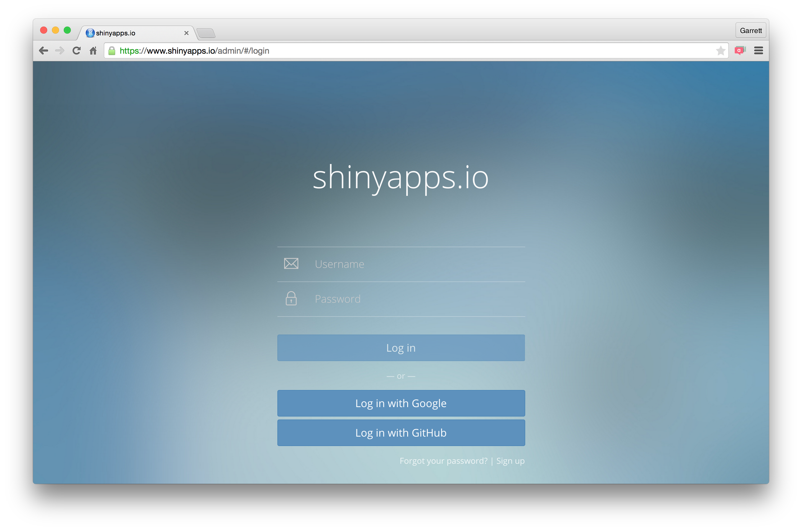
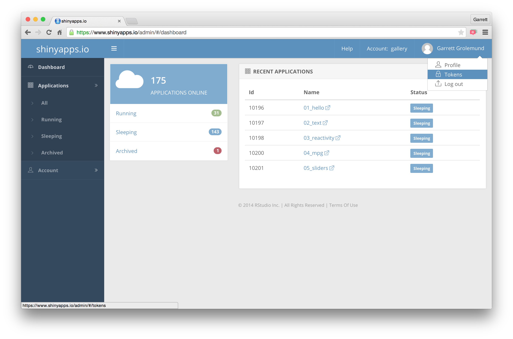
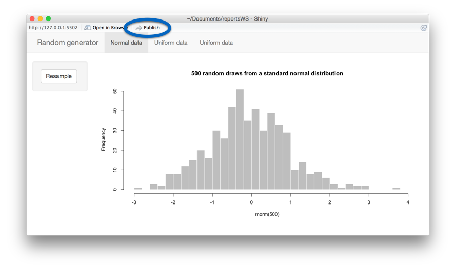
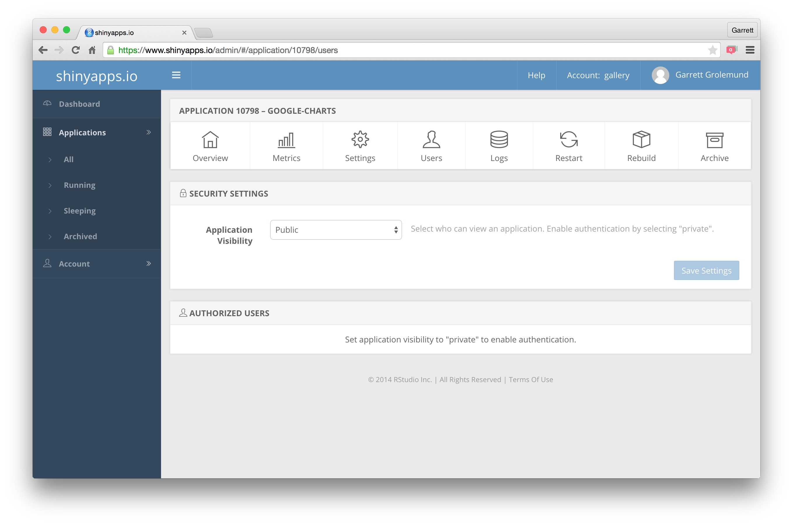
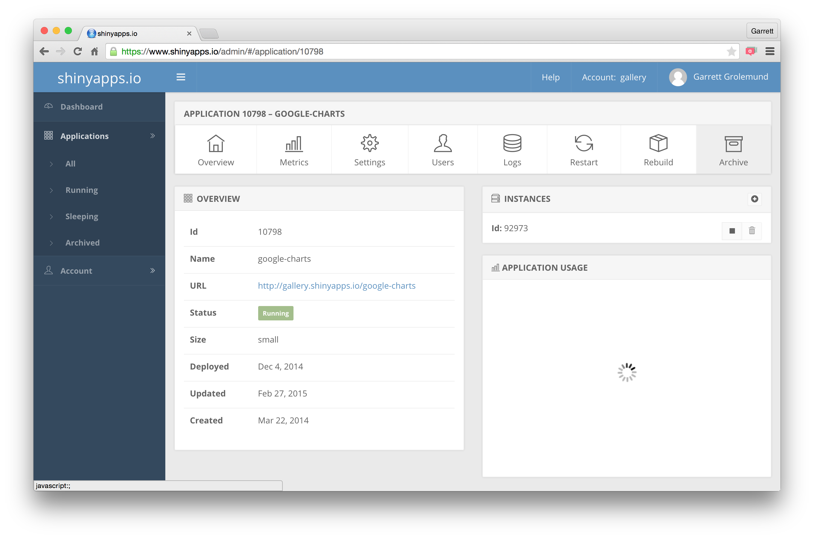

```{r echo = FALSE}
library(shiny)
```

***

These notes explain how to share Shiny web apps and interactive documents. The notes accompany RStudio's workshop, [Interactive Reporting with R Markdown and Shiny](http://shiny-dc.eventbrite.com). For more details on using Shiny see <http://shiny.rstudio.com>.

These notes build on the companion study guides, 

* _Study Guide 1 - R Markdown Reports_
* _Study Guide 2 - Interactive Docs_
* _Study Guide 3 - Shiny Web Apps_

which describe how to build R Markdown reports, interactive documents, and Shiny web apps.

# Sharing

Share a Shiny app by

1. Sharing files for users to run locally with R
2. Hosting the app online
    + Users do not need to own or understand R to use a hosted Shiny app
3. Embedding the app in R
    + Package the app as an R function
    
# Share as files

Anyone with a copy of your app directory can run the app on their computer in the same way that you run the app on your own computer.

Shiny contains four functions that make it easy to share files for users to run locally. A user can call

* `runApp()` - to run apps whose files that have been downloaded to their computer
* `runGist()` - to run apps whose files have been posted at <http://gist.github.com>
* `runGitHub()` - to run apps whose files have been posted at <http://github.com>
* `runUrl()` - to run apps whose files have been posted at a web URL

# Host online

The most convenient way to share a Shiny app is to host it at its own URL. 

* users can easily visit the app
* users do not need to have R installed on their computer to run the app
* users do not need to understand R to use the app

You can host an app on the internet or on any intranet run by a server.

To host an app, either

1. Upload the app to <http://shinyapps.io>, a free hosting service run by RStudio.
2. Build a server to host the app with [Shiny Server](http://www.rstudio.com/products/shiny/shiny-server/) or [Shiny Server Pro](http://www.rstudio.com/products/shiny-server-pro/)

## shinyapps.io

Shinyapps.io is a free app hosting service with paid tiers maintained by RStudio. Shinyapps.io is

* **easy to use** - deploy apps with one click with the `shinyapps` package
* **secure** - password protect your apps with SSL encryption
* **scalable** - app resources scale as users increase. Apps that require large amounts of resources can be supported on a paid plan.

### Set up

To use shinyapps.io,

1. Install
    + (for Windows users only) [RTools](http://cran.r-project.org/bin/windows/Rtools/) for building packages
    + (for Mac users only) [Command Line Tools for XCode](http://railsapps.github.io/xcode-command-line-tools.html) for building packages
    + (for Linux users only) [GCC](https://gcc.gnu.org/wiki/InstallingGCC) for building packages
2. Install the `devtools` package from cran 

```{r eval = FALSE}
install.packages("devtools")
```

3. Install the `shinyapps` package from github
```{r eval = FALSE}
devtools::install_github("rstudio/shinyapps")
```
4. Load the `shinyapps` package
```{r eval = FALSE}
library("shinyapps")
```
5. Create an account at <http://shinyapps.io>
   + Sign in with a Google or Github account, or create a new shinyapps.io account


6. Retrieve your token from the shinyapps.io dashboard by clicking _<Your username> (Upper right hand corner) > Token > Show > Copy to clipboard


7. Paste the copied command into the RStudio command line and click enter
```{r eval = FALSE}
shinyapps::setAccountInfo(name='something', token='something', secret='something')
```

These steps link your RStudio IDE to your shinyapps.io account. They also prepare your computer to build apps (and their package dependencies) to deploy online.

### deploy

To deploy an app to the internet, 

1. Package the app as a directory that contains the `app.R` file (or `server.R` and `ui.R` files) as well as all supporting files used by the app.
1. Launch the app in the RStudio preview window
2. Click "Publish"



3. Alternatively, run

```{r eval = FALSE}
shinyapps::deployApp("<filepath to app directory>")
```

`shinyapps` will upload the app to <http://shinyapps.io>, where it will be hosted with its own URL.

### password protect

To password protect your app, 

1. Visit your app dashboard at <http://shinyapps.io>
2. Navigate to the "Users" tab
3. Set Application visibility to "Private"
4. Enter authorized users



### archive

To archive an app (the app will no longer be accessible over the internet

1. Visit your app dashboard at <http://shinyapps.io>
2. Click the "Archive" tab


3. Alternatively, run

```{r eval = FALSE}
shinyapps:terminateApp("<filepath to app directory>")
```

## Build a server

RStudio makes two products to help you build your own server to host, maintain, and monitor your Shiny apps.

### Shiny Server

[Shiny Server](http://www.rstudio.com/products/shiny/shiny-server/) is a free and open source software for building servers to hos Shiny apps on a linux box.

### Shiny Server Pro

[Shiny Server Pro](http://www.rstudio.com/products/shiny-server-pro/) is a professional version of Shiny Server, tuned for commerical use. It provides enhanced:

* **security** with LDAP, ActiveDirectory, GoogleAuth, PAM, SSL, and more.
* **performance** with multiple tuning parameters
* **administrative control** to monitor and manage resource use
* **support** from RStudio, Inc.

[Try a free 45 Day evaluation](http://www.rstudio.com/products/shiny-server-pro/) of Shiny Server Pro.

### Learn more

To learn more about building your own server with Shiny Server or Shiny Server Pro, visit the [Shiny Server Admin Guide](http://rstudio.github.io/shiny-server/latest/).

## Performance

Sharing an app with multiple users tests your code in new ways.

To keep your app fast, ensure that the app does not re-run code more often than it needs to. Apps run code on three occasions:

1. **When a rendered output is invalidated** (becomes out of date). 
    + Shiny will rerun all of the code in a `render*()` call whenever it needs to rebuild the rendered object. 
    + This code may be rerun hundreds of times a minute. 
    + Do not place any code in a `render*()` call that does not need to be rerun each time the object becomes out of date.
2. **When a new user vists your app**
    + Shiny will run the server function of your app each time a new user visits your app or refreshes their browser.
    + This code may be rerun many times if your app is hosted online.
    + Limit your server function to code that needs to be run once for each new user (for example, code that creates a fresh set of objects for the user).
3. **When you first launch your app**
    + Shiny will run all of the code in `app.R` or `server.R` when you first launch the app, including code that comes before you define the server function.
    + This is a good place to put code that only needs to be run once to set up your computer/server (for example, `library()`, `source()`, and `load()` commands).

# Embed in R

Share your apps through the R command line by packaging your apps in a package or function.

## In a package

To add an app to a package

1. Save the app directory in the package's `inst` directory
2. Write a function that calls the app with `system.file()` and `runApp()` 
    + `system.file()` returns the filepath to a directory or file in an R package.
    + `runApp()` launches an app
    + An example function:
    
```{r eval = FALSE}
myApp <- function() {
  require(shiny)
  runApp(system.file("<app directory>", package = "<package name>"))
}
```

## In a function

Embed single file apps in a function by having the function return the result of `shinyApp()`, e.g.

```{r}
myShinyFun <- function() {
  serv <- function(input, output) {
    output$hist <- renderPlot({
      hist(faithful$eruptions, breaks = input$n_breaks,
        probability = TRUE, xlab = "Duration (minutes)", 
        main = "Geyser eruption duration")
    })
  }
  ui <- fluidPage(
    sidebarLayout(
      sidebarPanel(
        sliderInput("n_breaks", label = "Number of bins:", 
          min = 10, max = 50, value = 25)
      ),
      mainPanel(plotOutput("hist"))
    )
  )
  shinyApp(server = serv, ui = ui, options = list(height = 600))
}

myShinyFun()
```

### Parameterize

Parameterize apps by passing function arguments into the app:

***

**Your Turn** - Parameterize the function below.

1. Define an argument named `vec` for the function.
    + `vec` hould take a vector of numbers
2. Modify the histogram call so that it plots a histogram of `vec` instead of `faithful$eruptions`
3. Run the function definition at the command line. Then try running
    + `myShinyFun(vec = rnorm(500))`
    + `myShinyFun(vec = faithful$eruptions)`
    + `myShinyFun(vec = iris$Sepal.Length)`

```{r eval = FALSE}
myShinyFun <- function() {
  serv <- function(input, output) {
    output$hist <- renderPlot({
      hist(faithful$eruptions, breaks = input$n_breaks,
        probability = TRUE, xlab = "Duration (minutes)", 
        main = "Geyser eruption duration")
    })
  }
  ui <- fluidPage(
    sidebarLayout(
      sidebarPanel(
        sliderInput("n_breaks", label = "Number of bins:", 
          min = 10, max = 50, value = 25)
      ),
      mainPanel(plotOutput("hist"))
    )
  )
  shinyApp(server = serv, ui = ui, options = list(height = 600))
}
```

***

### stopApp()

Use `stopApp()` to close a shiny app and return a value to the frame that called `runApp()`.

`stopApp()` lets you launch a Shiny app to collect a value.

To use `stopApp()`,

1. Put an `actionButton()` in the ui that a user can click to stop the app
2. Use `observe()` to run `stopApp()` when the button value != 0
3. Give `stopApp()` a value to return
    + The value will be returned as a non-reactive value
    + `stopApp()` isolates the value (shanges in the value will not trigger the `observe()` chunk to run
4. Wrap `shinyApp()` with `runApp()` to return the value to the function.
    + Otherwise value will be returned to the invisible `print()` call on `shinyApp()` and lost.

_Note: run this example in its own script to avoid closing the study guide._
```{r eval = FALSE}
trimmedMean <- function(vec) {
  serv <- function(input, output) {
    tmean <- reactive(mean(vec, trim = input$trim))
    observe(if (input$stop > 0) stopApp(tmean()))
    output$mean <- renderText(tmean())
    output$hist <- renderPlot(hist(vec))
  }
  ui <- fluidPage(
    sidebarLayout(
      sidebarPanel(
        sliderInput("trim", label = "Trim mean by", 
          min = 0, max = 0.5, value = 0, step = 0.01),
        h1(textOutput("mean")),
        actionButton("stop", "Return Value")
      ),
      mainPanel(plotOutput("hist"))
    )
  )
  runApp(shinyApp(server = serv, ui = ui))
}

tm <- trimmedMean(vec = rnorm(1000))
tm
```
